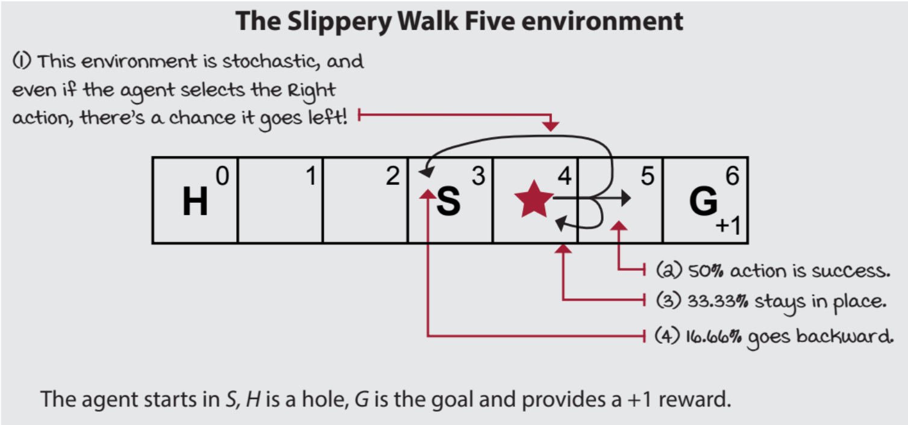
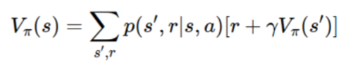
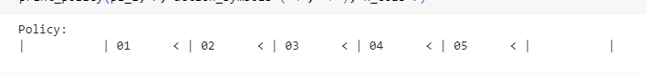
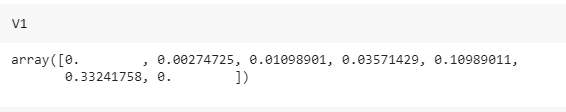
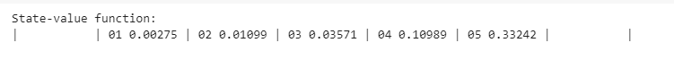
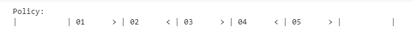
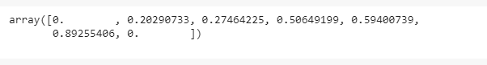
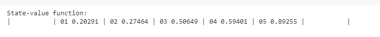

# POLICY EVALUATION

## AIM
To develop a Python program to evaluate the given policy.

## PROBLEM STATEMENT
The bandit slippery walk problem is a reinforcement learning problem in which an agent must learn to navigate a 7-state environment in order to reach a goal state. The environment is slippery, so the agent has a chance of moving in the opposite direction of the action it takes.
### States
The environment has 7 states:

- Two Terminal States: 
    - G: The goal state  
    - H: A hole state.
- Five Transition states / Non-terminal States including S: The starting state.
### Actions
The agent can take two actions:

- R: Move right.
- L: Move left.

### Transition Probabilities
The transition probabilities for each action are as follows:

- 50% chance that the agent moves in the intended direction.
- 33.33% chance that the agent stays in its current state.
- 16.66% chance that the agent moves in the opposite direction.

For example, if the agent is in state S and takes the "R" action, then there is a 50% chance that it will move to state 4, a 33.33% chance that it will stay in state S, and a 16.66% chance that it will move to state 2.

### Rewards
- The agent receives a reward of +1 for reaching the goal state (G). 
- The agent receives a reward of 0 for all other states.

### Graphical Representation


## POLICY EVALUATION FUNCTION


## PROGRAM
```py
#program developed by : JEEVA ABISHAKE A
#register no: 212221240018
```
### policy evaluation: 
```py
def policy_evaluation(pi, P, gamma=1.0, theta=1e-10):
    prev_V = np.zeros(len(P), dtype=np.float64)
    while True:
      V=np.zeros(len(P),dtype=np.float64)
      for s in range(len(P)):
        for prob, next_state, reward, done in P[s][pi(s)]:
          V[s]+=prob*(reward+gamma*prev_V[next_state]*(not done))
      if np.max(np.abs(prev_V-V))<theta:
        break
      prev_V=V.copy()
    return V

# First Policy
pi_1 = lambda s: {
    0:LEFT, 1:LEFT, 2:LEFT, 3:LEFT, 4:LEFT, 5:LEFT, 6:LEFT
}[s]
print_policy(pi_1, P, action_symbols=('<', '>'), n_cols=7)
# Second Policy

pi_2 = lambda s: {
    0:LEFT, 1:RIGHT, 2:LEFT, 3:RIGHT, 4:LEFT, 5:RIGHT, 6:LEFT
}[s]

print_policy(pi_2, P, action_symbols=('<', '>'), n_cols=7)
```
### policy comparison:
```py 
# Code to evaluate the first policy
V1 = policy_evaluation(pi_1, P)
print(V1)
print_state_value_function(V1, P, n_cols=7, prec=5)

# Code to evaluate the second policy
V2 = policy_evaluation(pi_2, P)
print(V2)
print_state_value_function(V2, P, n_cols=7, prec=5)

# Compare the two policies based on the value function using the above equation and find the best policy
print(V1>=V2)
if(np.sum(V1>=V2)==7):
  print("The first policy is the better policy")
elif(np.sum(V2>=V1)==7):
  print("The second policy is the better policy")
else:
  print("Both policies have their merits.")
```
## OUTPUT:
## <u> policy 1: </u>

### policy


### policy evluation:


### state value function:


## <u> policy 2: </u>
### policy


### policy evluation:


### state value function:


## <u> policy comparison: </u> 


## RESULT:
Thus, a Python program is developed to evaluate the given policy.